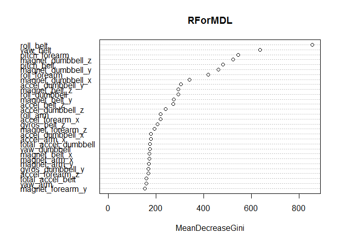

# Machine Learning Fitness Model
Gregory Smith  
February 19, 2016  
#Executive Summary
This report attempts to use various machine learning models in order to build a model to predict a grade based on how well a subject lifts a dumbell.  We limit the columns that have at least 50% valid entries, as well as eliminate any columns with near zero variance.  We divide the data into two sets, a training and cross-validating set.  We try three models,  Classification Tree, Support Vector Machines, and Random Forests.  Through cross validating we determine the most accurate mode.  We use the chosen model to prepare the results for the quiz.

#Introduction
Background

Using devices such as Jawbone Up, Nike FuelBand, and Fitbit it is now possible to collect a large amount of data about personal activity relatively inexpensively. These type of devices are part of the quantified self movement - a group of enthusiasts who take measurements about themselves regularly to improve their health, to find patterns in their behavior, or because they are tech geeks. One thing that people regularly do is quantify how much of a particular activity they do, but they rarely quantify how well they do it. In this project, your goal will be to use data from accelerometers on the belt, forearm, arm, and dumbell of 6 participants. They were asked to perform barbell lifts correctly and incorrectly in 5 different ways. More information is available from the website here: http://groupware.les.inf.puc-rio.br/har (see the section on the Weight Lifting Exercise Dataset).

###Configure Environment

```r
require(caret)
```

```
## Loading required package: caret
```

```
## Loading required package: lattice
```

```
## Loading required package: ggplot2
```

```r
require(ggplot2)
require(corrgram)
```

```
## Loading required package: corrgram
```

```r
require(rpart)
```

```
## Loading required package: rpart
```

```r
require(e1071)
```

```
## Loading required package: e1071
```

```r
require(randomForest)
```

```
## Loading required package: randomForest
```

```
## randomForest 4.6-12
```

```
## Type rfNews() to see new features/changes/bug fixes.
```

```
## 
## Attaching package: 'randomForest'
```

```
## The following object is masked from 'package:ggplot2':
## 
##     margin
```

#Data Preparation

##Getting the data

The training data for this project are available here:

https://d396qusza40orc.cloudfront.net/predmachlearn/pml-training.csv

The test data are available here:

https://d396qusza40orc.cloudfront.net/predmachlearn/pml-testing.csv

The data for this project come from this source: http://groupware.les.inf.puc-rio.br/har. If you use the document you create for this class for any purpose please cite them as they have been very generous in allowing their data to be used for this kind of assignment.


```r
TrainDataURL <- "http://d396qusza40orc.cloudfront.net/predmachlearn/pml-training.csv"
TestDataURL <- "http://d396qusza40orc.cloudfront.net/predmachlearn/pml-testing.csv"
RawTraining <- read.csv(url(TrainDataURL))
RawTesting <- read.csv(url(TestDataURL))
```

###Identify the data

```r
#summary(RawTraining)
#head(RawTraining)
table(RawTraining$classe)
```

```
## 
##    A    B    C    D    E 
## 5580 3797 3422 3216 3607
```

```r
table(RawTraining$user_name, RawTraining$classe)
```

```
##           
##               A    B    C    D    E
##   adelmo   1165  776  750  515  686
##   carlitos  834  690  493  486  609
##   charles   899  745  539  642  711
##   eurico    865  592  489  582  542
##   jeremy   1177  489  652  522  562
##   pedro     640  505  499  469  497
```
Based on our initial exploration
[1] "X" Record Index
[2] "User_name" User Name
[3-5] "raw_timestamp_part_1" "raw_timestamp_part_2" "cvtd_timestamp" Time Tracking 
[6,7] "new_window" "num_window"
[8-159] Various Movement variables
[160] "classe"  Rating of movement.  (Target for our identifier)

###Preping and cleaning up the data
Remove the first 7 identifier columns of data not needed for training on the data
Remove columns with more than 50% NA
Remove columns with NZV Near Zero Variance


```r
#remove the identifiers not required for training
TrainingData <- RawTraining[,8:160]

#Remove columns with more than 50% NAs
highNA <- sapply(TrainingData, function(x) mean(is.na(x))) > 0.50
TrainingData <- TrainingData[,highNA == FALSE]
#remove columns with near zero variance 
NZV <- nearZeroVar(TrainingData)
TrainingData <- TrainingData[,-NZV]
dim(TrainingData)
```

```
## [1] 19622    53
```
The variables have been limited down to 58 columns of valid and useful data

Divide that data into two sets
        train data (70%)
        cross validating data (30%)


```r
#Split data into training and cross validation sets
set.seed(162013)
PartedData <- createDataPartition(y=TrainingData$classe, p = .70, list = FALSE)
Data_Train <- TrainingData[PartedData,]
Data_Cross <- TrainingData[-PartedData,]
```

# Preparing the Models

## Model 1 - Classification Tree

```r
TreeMDL <- rpart(classe ~ .,
  	method="class", data=Data_Train)
predictTree <- predict(TreeMDL, Data_Cross, type = "class")

CrossValidationTree <- mean(predictTree == Data_Cross[ ,53]) 
```
The classification tree model received a 73.4919286% success rate on our cross validation data.

## Model 2 - Support Vector Machines

```r
SVMMDL <- svm(classe ~.,data= Data_Train)
PredictSVM <- predict(SVMMDL, Data_Cross, type = "class")
CrossValidationSVM <- mean(PredictSVM == Data_Cross[,53])
```
The Support Vector Machines model  received a 94.1206457% success rate on our cross validation data.

## Model 3 - Random Forest

```r
RForMDL <- randomForest(classe ~. , data=Data_Train)
PredictRFor <- predict(RForMDL, Data_Cross, type = "class")
CrossValidationRFor <- mean(PredictRFor == Data_Cross[,53])
```
The random forest model  received a 99.5412065% success rate on our cross validation data.


#Summary
A Deeper look into the results of the Random Forest Model

```r
confusionMatrix(PredictRFor, Data_Cross$classe)
```

```
## Confusion Matrix and Statistics
## 
##           Reference
## Prediction    A    B    C    D    E
##          A 1674    4    0    0    0
##          B    0 1133    5    0    0
##          C    0    2 1019   10    0
##          D    0    0    2  953    3
##          E    0    0    0    1 1079
## 
## Overall Statistics
##                                          
##                Accuracy : 0.9954         
##                  95% CI : (0.9933, 0.997)
##     No Information Rate : 0.2845         
##     P-Value [Acc > NIR] : < 2.2e-16      
##                                          
##                   Kappa : 0.9942         
##  Mcnemar's Test P-Value : NA             
## 
## Statistics by Class:
## 
##                      Class: A Class: B Class: C Class: D Class: E
## Sensitivity            1.0000   0.9947   0.9932   0.9886   0.9972
## Specificity            0.9991   0.9989   0.9975   0.9990   0.9998
## Pos Pred Value         0.9976   0.9956   0.9884   0.9948   0.9991
## Neg Pred Value         1.0000   0.9987   0.9986   0.9978   0.9994
## Prevalence             0.2845   0.1935   0.1743   0.1638   0.1839
## Detection Rate         0.2845   0.1925   0.1732   0.1619   0.1833
## Detection Prevalence   0.2851   0.1934   0.1752   0.1628   0.1835
## Balanced Accuracy      0.9995   0.9968   0.9954   0.9938   0.9985
```

```r
varImpPlot(RForMDL)
```



The Random Forest model achieved a success rate of 99.5% on our cross validation data.

###Prediction for TestSet

```r
predictions <- predict(RForMDL,newdata=RawTesting)
#print(predictions)
```
